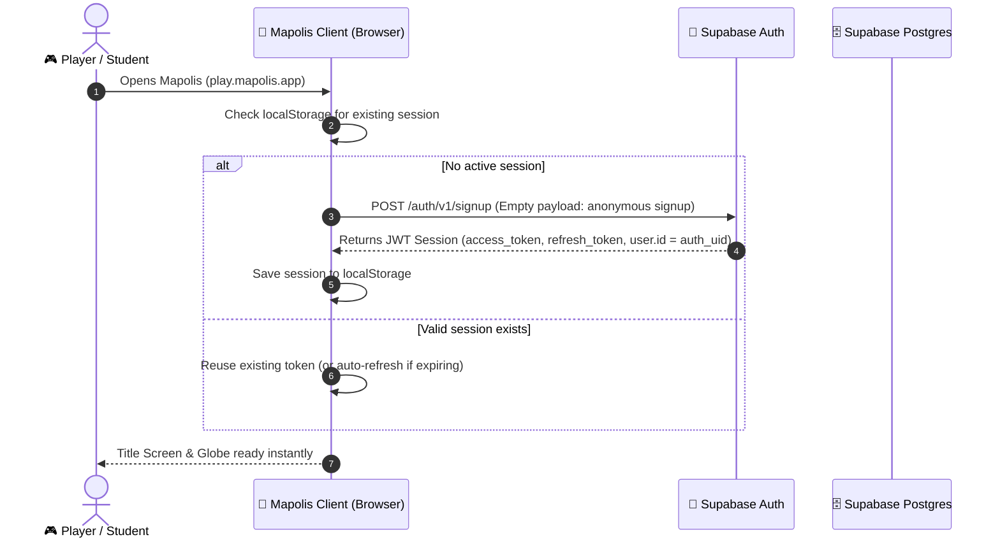
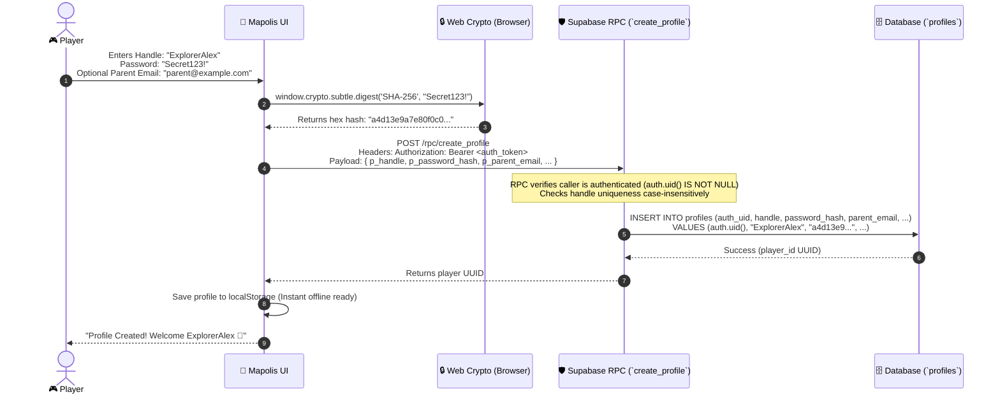
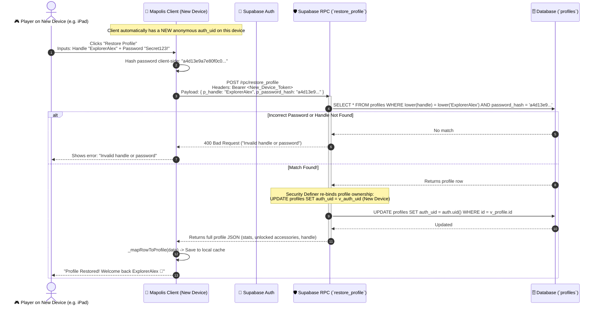
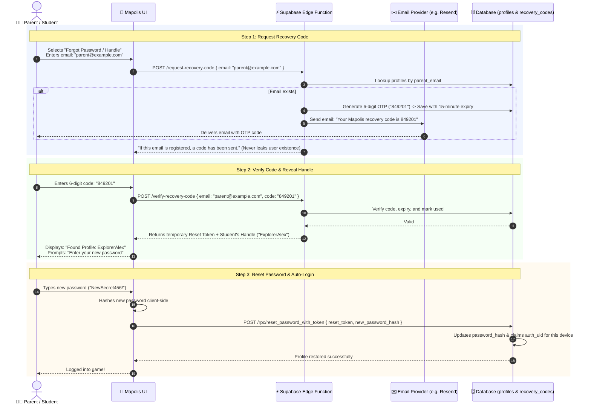

# Mapolis Architecture & Data Flow Guide

This document visualizes and explains the authentication, profile management, and account recovery architecture for **Mapolis**. It is designed to be easily shared with developers, stakeholders, and compliance auditors.

---

## 1. High-Level Architecture Overview

Mapolis uses an **Anonymous Auth + Custom Profile Layer** pattern. This ensures strict **COPPA / FERPA** compliance for student privacy:
* **No personal identifying accounts are forced upfront**: Students play under an anonymous cryptographic session.
* **Credentials never travel in plaintext**: Passwords are mathematically hashed (`SHA-256`) client-side before touching the network.
* **Row-Level Security (RLS) & RPCs**: Direct database access is locked down. Profile creation and cross-device recovery happen strictly via security-definer Remote Procedure Calls (RPCs).

```
+----------------------------------------------------------------------------------------------------+
|                                         CLIENT (Browser)                                           |
|                                                                                                    |
|  [ localStorage ] <---> [ syncStore Data Layer ] <---> [ UI: Solo Game, H2H, Profile, Restore ]    |
|   (Fast offline          (Queuing, deduping,            (Client-side SHA-256 hashing, UI state)    |
|    cache & queue)         session handling)                                                        |
+------------------------------------------+---------------------------------------------------------+
                                           |
                              HTTPS / REST | (Bearer Token + Anon Key)
                                           v
+----------------------------------------------------------------------------------------------------+
|                                    SUPABASE BACKEND                                                |
|                                                                                                    |
|   [ Supabase Auth (GoTrue) ]          [ Postgres Database ]                                        |
|   - Anonymous session generation      - Table: `profiles` (RLS protected)                          |
|   - Issues JWT token (`auth.uid()`)   - Stored: `auth_uid`, `handle`, `password_hash`, `stats`     |
|                                       - Stored: `parent_email` (optional for recovery)             |
|                                                                                                    |
|                                       [ Security-Definer RPCs ]                                    |
|                                       - `create_profile(...)`                                      |
|                                       - `restore_profile(...)`                                     |
|                                       - `restore_profile_by_email(...)`                            |
+----------------------------------------------------------------------------------------------------+
```

---

## 2. Flow 1: First Launch & Anonymous Session

When a player opens Mapolis on any device for the first time, an anonymous auth token is issued automatically in the background.



---

## 3. Flow 2: Creating a Profile (Zero-Knowledge Passwords)

When a player creates a profile, the password is never sent across the internet as plain text. The browser hashes it using standard Web Crypto API (`SHA-256`), and the profile is linked to the player's anonymous `auth_uid`.



---

## 4. Flow 3: Restoring a Profile on a New Device (Handle + Password)

This is the flow that was just successfully verified on Safari. When a player moves from a school Chromebook to a home iPad:



---

## 5. Flow 4: Planned Email & Forgotten Credentials Flow (OTP)

Below is the visual blueprint for the upcoming **Pre-Beta 1** email recovery and forgotten password workflow.



---

## 6. Summary of Key Security & Architecture Principles

| Feature | How Mapolis Implements It | Benefit |
| :--- | :--- | :--- |
| **COPPA / FERPA Compliance** | Anonymous UUID sessions, minimal PII, optional parent email | Student identities and browsing habits cannot be tracked or sold |
| **Password Security** | Client-side `SHA-256` hashing before transmission | Zero-knowledge storage. Mapolis servers never see or store plain text passwords |
| **Row-Level Security (RLS)** | PostgreSQL RLS enabled on all sensitive tables | Users can only view or modify their own data directly |
| **Cross-Device Handoff** | Security-Definer RPCs (`restore_profile`) | Players can migrate progress seamlessly between school and home devices |
| **Network Resilience** | `localStorage` fallback + background sync queues | Works smoothly offline, buffering progress until a connection returns |
